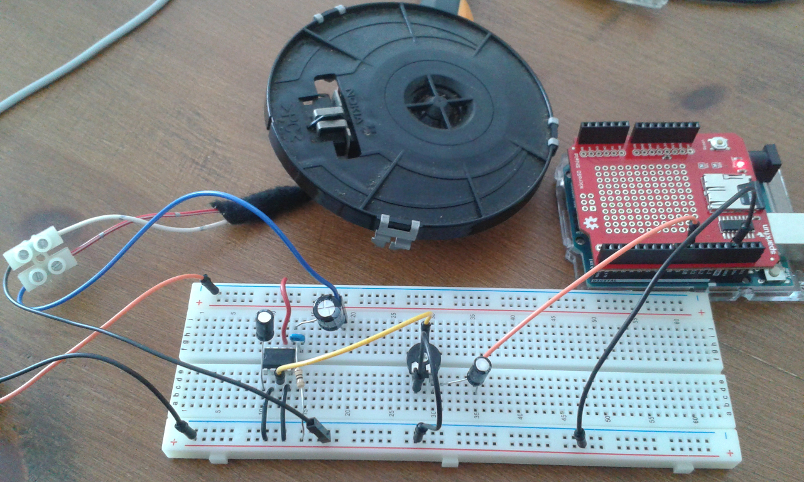

# arduino_play_sound
Playing sounds from SD card with arduino UNO.

- Using [TMRpcm](https://github.com/TMRh20/TMRpcm) library to read .wav files from SD card and convert them to analog signal.

- Anolog circuit inspired from [here](https://www.arduino.cc/en/Tutorial/SimpleAudioPlayer), which uses a [LM386N3](http://www.ti.com/lit/ds/symlink/lm386.pdf) analog audio amplifier.

##SD card file format
According [SD Arduino reference page], SD card should be formatted to FAT16 or FAT32 file system, and file names have to fulfill 8.3 naming convention (at most 8 characters + dot + 3 extension characters).

## .wav file format
The TMRpcm library runs with wav files with the following features:
- Bit resolution: 8 bits
- Sampling rate: 16KHz
- Audio channels: mono
- PCM format: 8-bit, unsigned

You can use [thi onlie converter](http://audio.online-convert.com/convert-to-wav) to prepare the wav files to store in the SD card.
